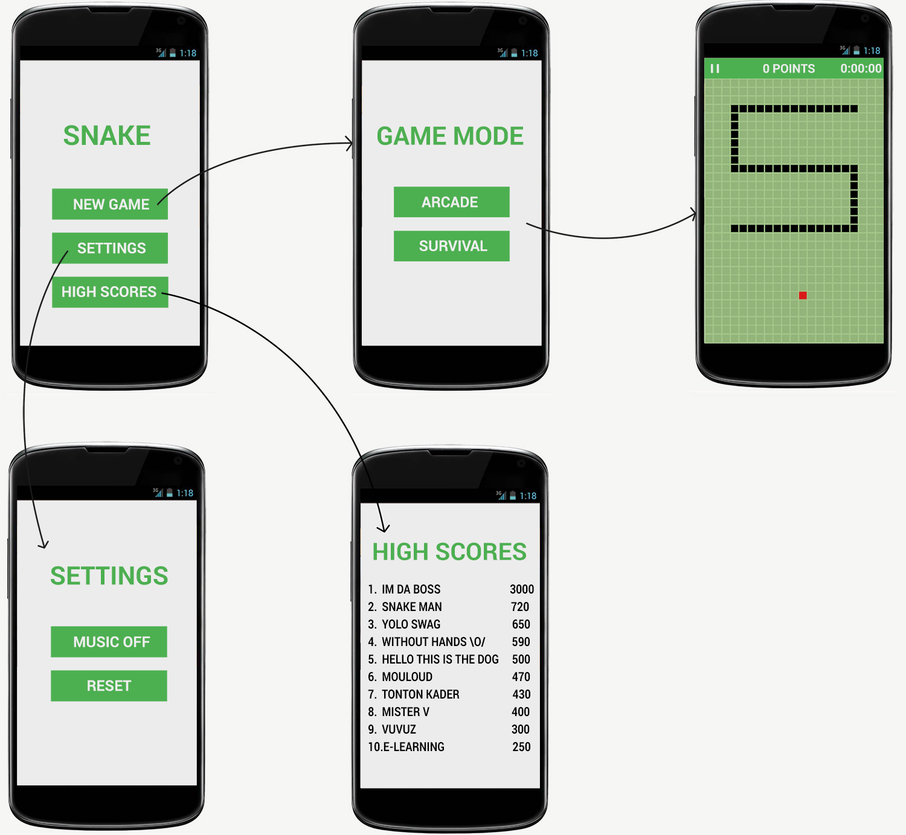

# Snake


## Bibliographie

### Principe du jeu

Le jeu du snake consiste à contrôler un serpent qui fait au départ 3 unités de longueur.
Afin de gagner un niveau, le joueur doit manger des fruits afin de faire grandir le serpent pour atteindre une certaine taille.

Afin d’atteindre la fin du niveau, le joueur doit éviter tout contact avec :
- son corps
- le labyrinthe
- les bords de l’écran

Seule la tête du snake peut être déplacée par le joueur, le reste du corps suit suivant les
mouvements de la tête.

<p align="center">
  
</p>


### Format du jeu

Le plateau du jeu est un carré de 50 cases de côté.

Modes de jeu :
- Survival Mode
- Arcade Mode


#### Survival Mode

Choisissez votre niveau et essayer d’atteindre le plus haut score possible sans entrer en collision avec un mur ou le corps du serpent.


#### Arcade Mode

Vous commencez au niveau 1 et devez atteindre le score de 25 pour passer au niveau suivant. Le fait de passer au niveau supérieur augmente petit à petit la difficulté.


### Itérations

- Par défault le snake avance tout droit.
- Il change de direction lorsque l'utilisateur appuye sur l'écran, il se déplace vers le doigt de l'utilisateur (à calculer).
- Perd quand le snake est coincé (par lui-même ou le bord de la map).
- Le snake grossit lorsqu’il mange un objet.
- Sauvegarder les meilleurs scores et afficher le classement à la fin d’une partie.
- Bouton pause/quitter(&sauvegarder?) la partie.
- Consulter les meilleurs scores depuis le menu principal.


## Modèle
```
Fruit {
  // Le fruit doit être mangé par le snake. Il n’y en aura qu’un seul sur le monde à chaque fois. Le fait de le manger va augmenter le score du joueur, la taille du snake de 1 et va replacer un nouveau fruit  à un endroit aléatoire sur le monde.
  x: Int // position honrizontale du fruit dans le monde)
  y: Int // position verticale du fruit dans le monde)

  respawn(): // supprime le fruit existant (si il existe) et en place un nouveau sur le monde de façon aléatoire.
}

Snake {
  // Le snake est l’élément principal du jeu, il y en un seul sur le monde et il est de taille variable, il grandit pour chaque fruit mangé. Le snake est contrôlé directement par le joueur.
 cells: Array<Cell>
 direction: U | R | D | L (Up: y+1, Right: x+1, Down: y-1, Left: x-1), L par défaut

  spawn(): void
  move(x: Int, y: Int):
  eat(): void // Mange le fruit présent sur la case, et augmente la taille par la méthode grow
  grow(): void // Augmente la taille du serpent d’une unité de longueur. Cette ajout se fera derrière la tete du serpent.
}

Cell {
  // Une cellule, le monde en est composé. Elle peut être vide, occupée par le serpent ou le fruit.
  x: Int // position honrizontale de la cellule dans le monde
  y: Int // position verticale de la cellule dans le monde
  state: empty | fruit | head | tail *// Etat de la cellule

  isEmpty(): boolean // Retourne true si la cellule est vide, false dans le cas contraire.
}

World {
  // Le monde où evolue le snake. Il est composé de cellules. L’ensemble de ses déplacements se fait à l’intérieur de ce monde. En cas de sortie de celui-ci, la partie est terminée.
  width: Int  // Largeur du monde
  height: Int // longueur du monde
  snake: Snake
  fruit: Fruit
  cells: Array<Cell>

  fill(): void // rempli le monde de cellules
}

Player {
  // Le joueur de la partie.
  score: Int // Score du joueur (Thanks Captain Obvious!)

}

Timer (Thread) {
  // Ce thread aura une fonction de décompte du temps. Il sera exécuté en parallèle du thread principal.
  speed: Int

  run(): void  // En fonction de speed, à chaque décompte de temps, le thread declenchera une action.
}
```


### Initialisation

- Instanciation du monde + appel de la méthode fill() pour remplir le monde de cellules vides

- Instanciation du joueur avec un score à 0, sans prénom (on demandera son nom dans le cas où le joueur désire sauvegarder son score).

- Instanciation du snake de taille 3, positionné au centre du monde, les 3 cellules prennent le status “head”, “tail”, “tail”. Le snake a une direction initiale de L (vers la gauche).

- Instanciation d’un fruit, appel de la méthode respawn() qui va faire apparaitre le fruit sur une case aléatoire vide.

- Instanciation du Timer. Il va servir à envoyer des tick de façon régulière. A chaque tick le monde appelera la méthode move() du snake. Si le joueur a indiqué une direction avant le tick, le snake bougera dans cette direction sinon, il se déplacera dans la même direction que le tour précédant.


### Déplacements

Explication :

Lors d’un déplacement, le snake reçoit une nouvelle direction, puis à la reception du tick par le timer, la tête va alors modifier ses coordonnées selon la direction.
Pour ce qui est de la queue, elle suit les mouvements de la tête. Pour chaque déplacement, on enlève la dernière partie de la queue, on déplace la tête dans la direction reçue et l’ancienne position de la tête devient une partie de la queue.

Déplacement avec comme direction R (Snake simple):
```
| T | T | H |   |   |                |   | T | T | H |   |
|   |   |   |   |   |                |   |   |   |   |   |
|   |   |   |   |   |       =>       |   |   |   |   |   |
|   |   |   |   |   |                |   |   |   |   |   |
|   |   |   |   |   |                |   |   |   |   |   |
      avant                                  après
```
Déplacement avec comme direction D (Snake complexe):
```
| T | T |   |   |   |                |   | T |   |   |   |
|   | T |   |   |   |                |   | T |   |   |   |
|   | T | T | H |   |       =>       |   | T | T | T |   |
|   |   |   |   |   |                |   |   |   | H |   |
|   |   |   |   |   |                |   |   |   |   |   |
      avant                                  après
```


## Infographie

### Écrans

<p align="center">
  
</p>

### Règles
Le monde sera composé de 600 cases. Il fera 30 cases de hauteur et 20 cases de largeur.
- mode arcade : Le but de ce mode de jeu est d'atteindre le niveau le plus élevé possible. Le serpent augmente à chaque fruit mangé.
Le niveau augmente tous les 25 fruits mangés. Des murs sont générés automatiquement et de façon aléatoire sur la carte.
Un mur prend une case de largeur. Plus le niveau est élevé, plus les murs seront nombreux.
Les murs seront placés de façon à ce que le fruit soit toujours atteignable par le snake sans mourir (comprendre qu'il ne peut pas y avoir de voies sans issues).
- mode survival : il consiste à tenir le plus longtemps possible sur la map, qui prend tout l'écran, sans murs, et ne se renouvèle pas.
Le serpent grossit d'une cases à chaque fois qu'il mange le fruit.

Le snake ne peut se déplacer que sur des cases vides ou occupées par un fruit. Il ne peut se déplacer que d'une case à la fois (vers le haut, le bas, la gauche ou la droite).
Les cases occupées par le snake seront représentées d'une couleur différente des cases vides.
Dans le cas où le snake a occupé toutes les cases du monde, un message sera affiché "Félicitations, vous avez gagné".

Le fruit occupe une seule case à la fois. Il fait une case de longueur et sera représenté par une couleur ou image différente.
Un fruit ne peut pas apparaitre sur une case occupée par :
- un mur
- le corps ou la tete du snake

Les "High scores" comprennent les 10 meilleurs scores classés par ordre décroissant. Il y en a 10 au maximum.
Dans le cas où il n'y a aucun score d'enregistré, un message "Pas de score" sera affiché.
La longueur d'un pseudo sera de 20 charactères maximum. Les "scores" pourront être remis à zéro via le bouton "reset" présent dans les paramètres de l'application.

